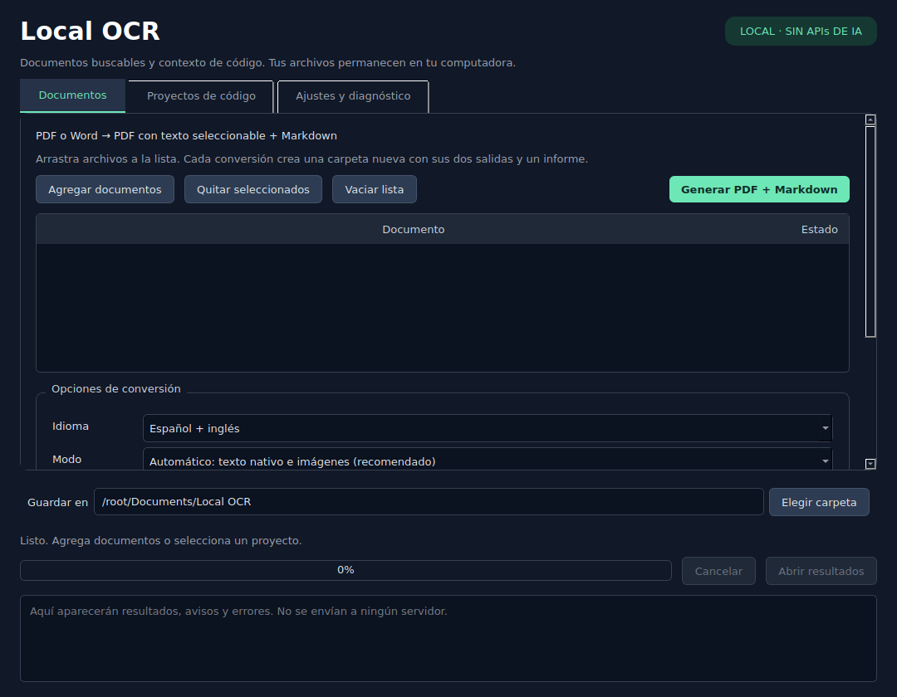
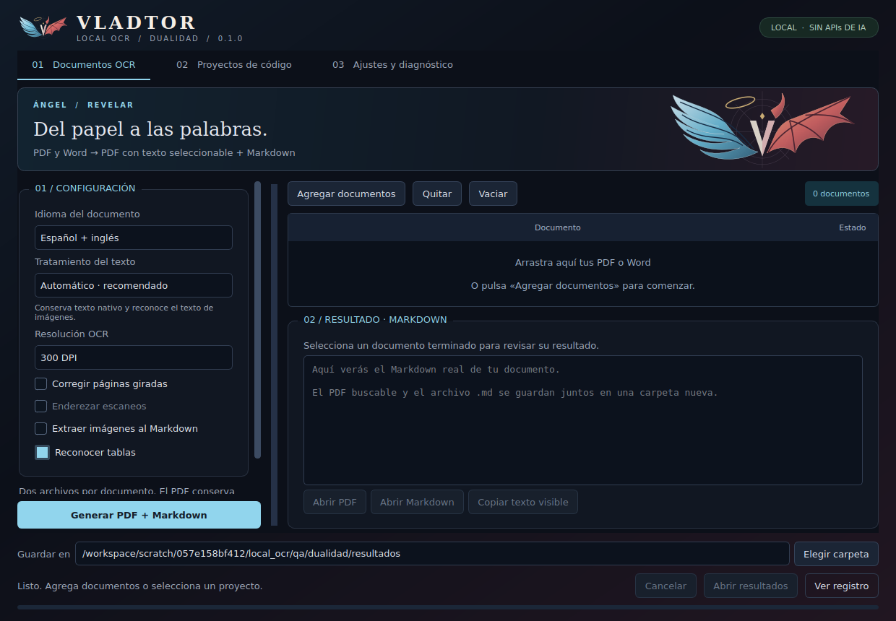
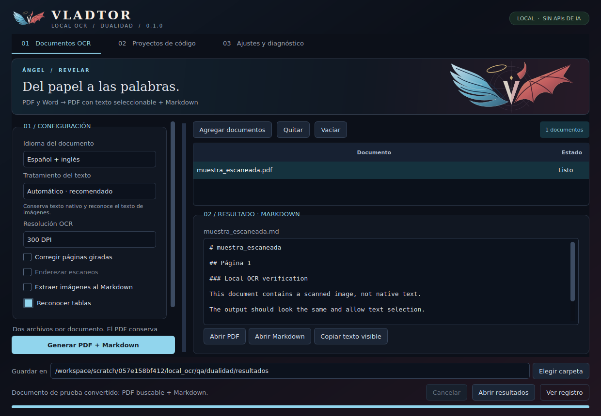
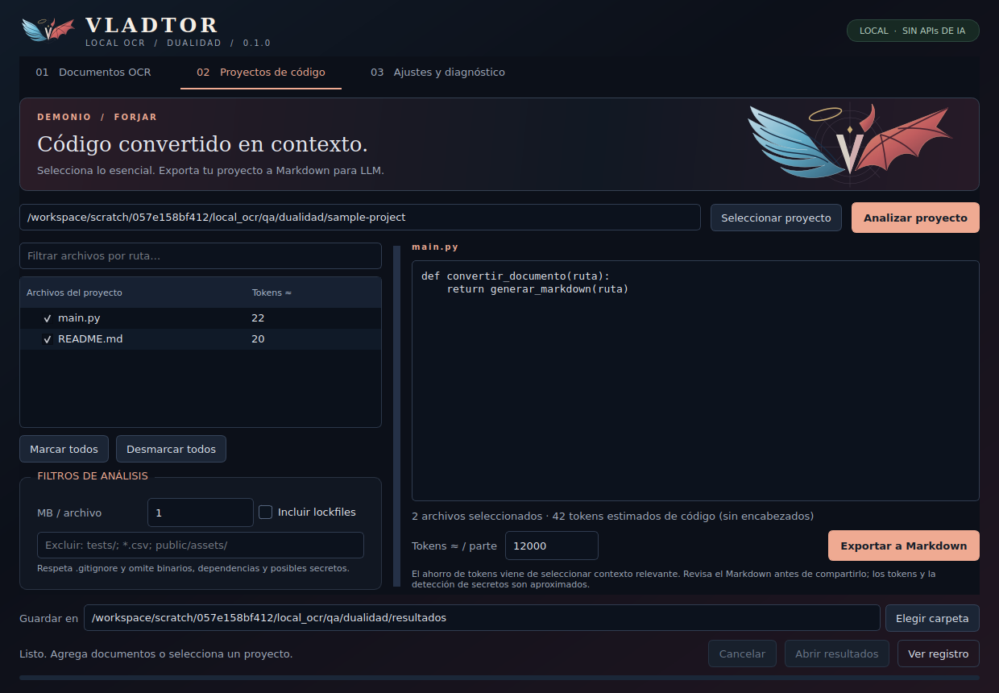

# Dos interfaces, un mismo proyecto

El punto de control de la interfaz original está en la rama
[`checkpoint/interfaz-original`](https://github.com/VladSoriano10/local_ocr/tree/checkpoint/interfaz-original).
Contiene el programa completo anterior al rediseño; puedes descargarlo con **Code → Download ZIP**.
La interfaz Dualidad está en `main`. Guarda cada versión en una carpeta distinta si quieres comparar.

## Interfaz original

Azul oscuro y verde menta, navegación por pestañas y registro siempre visible.

## Dualidad: documentos

El emblema combina un ala de plumas con halo y un ala de membrana con cuerno.
Documentos usa azul y dorado; proyectos usa rojo y cobre; ajustes usa violeta.
Los nombres de los controles describen su función.

La siguiente captura muestra el **OCR real de un documento de prueba generado por el script de QA**.
La vista del Markdown lee el archivo resultante; los botones abren el PDF y el Markdown completos.

## Dualidad: proyectos

Árbol con selección, exclusiones, vista previa y presupuesto aproximado de tokens por parte.
El ejemplo de código de la captura es una muestra de QA.

## Alcance de la adaptación

El HTML aportado sirvió como referencia de color, composición e identidad. La aplicación sigue
siendo nativa con PySide6 y conserva los motores de procesamiento local. Sus alas son vectores
incluidos en el código: no hay CDN, Google Fonts ni navegador embebido.

El registro se abre con **Ver registro** y aparece automáticamente ante errores. En ventanas
pequeñas los paneles permiten desplazamiento; no se ocultan opciones por falta de espacio.
Los paneles de documentos y proyectos tienen divisores ajustables.

La vista Markdown se limita a 100.000 caracteres para mantener la interfaz ágil. Se indica cuando
está truncada y **Copiar texto visible** copia solo esa vista. **Abrir Markdown** abre el archivo completo.

El visor PDF interno, XML, roles de prompts, editor de Markdown y porcentajes de precisión del
prototipo no forman parte de esta adaptación. Los resultados y el diagnóstico corresponden a
operaciones reales; no se muestran métricas inventadas.

Para regenerar las capturas de Dualidad: `python scripts/qa_preview.py qa/dualidad`.
Las capturas se obtuvieron en Linux con Qt; las fuentes y el marco nativo pueden variar en Windows.
